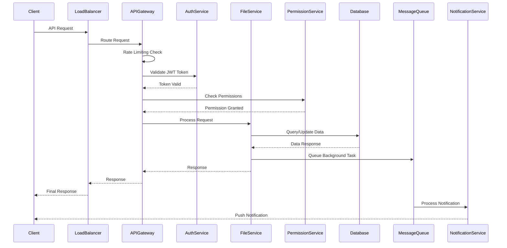
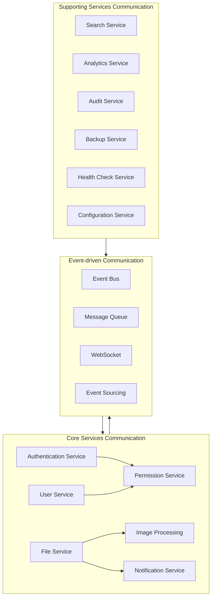
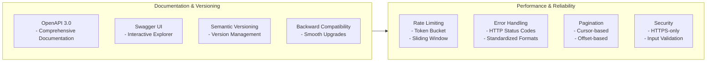
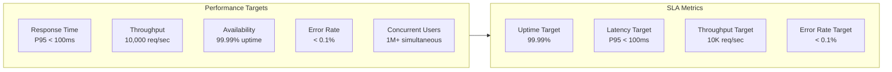
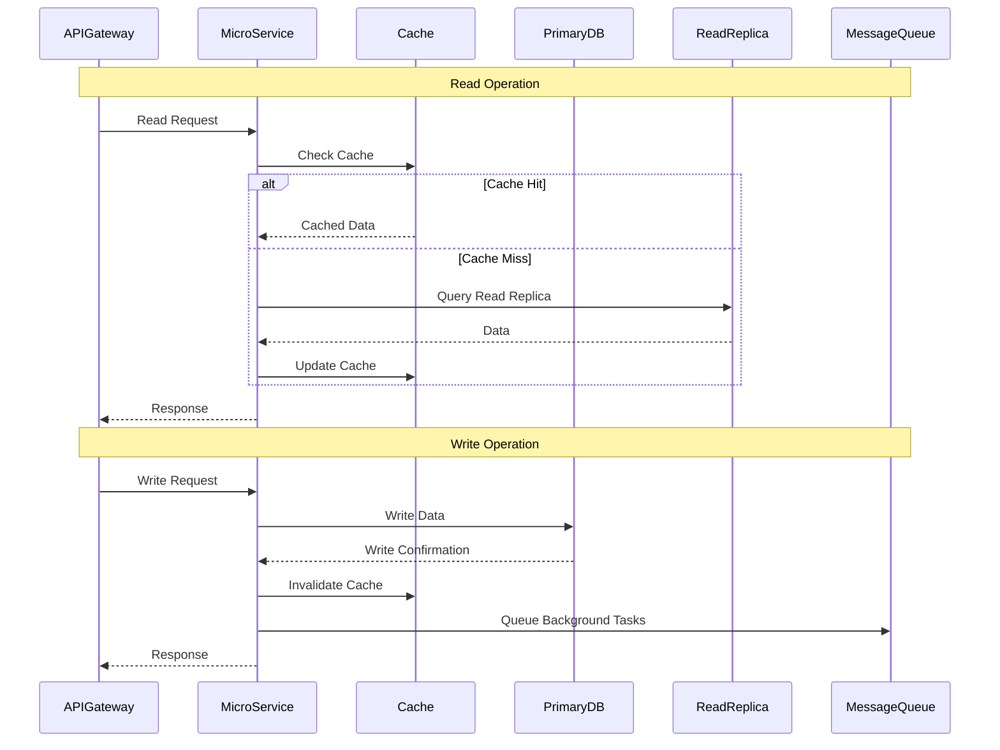
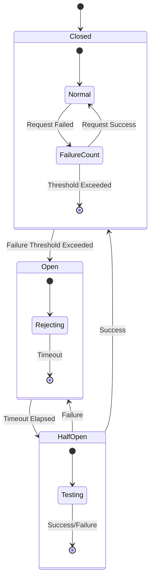

# API Architecture - Mermaid Diagrams

## API Architecture Overview

```mermaid
flowchart TD
    %% Client Layer
    subgraph ClientLayer ["Client Layer"]
        WebApp["Web App(Browser)"]
        MobileApp["Mobile App(iOS/Android)"]
        DesktopApp["Desktop App(Cross-platform)"]
        ThirdPartyAPI["Third-party API(External Systems)"]
        CLITools["CLI Tools(Command Line)"]
        SDKs["SDKs(Multiple Languages)"]
        Webhooks["Webhooks(Event-driven)"]
        GraphQLClient["GraphQL(Flexible Queries)"]
        WebSocketClient["WebSocket(Real-time)"]
        gRPCClient["gRPC(High Performance)"]
    end

    %% API Gateway Layer
    subgraph APIGatewayLayer ["API Gateway Layer"]
        LoadBalancer["Load Balancer\n- HAProxy/Nginx\n- SSL Termination\n- Traffic Distribution"]
        APIGateway["API Gateway\n- Kong/AWS API Gateway\n- Rate Limiting\n- Request Routing"]
        Authentication["Authentication\n- JWT Validation\n- OAuth 2.0\n- Token Management"]
        Authorization["Authorization\n- RBAC\n- Policy Engine\n- Permission Validation"]
        RequestRouting["Request Routing\n- Service Discovery\n- Load Balancing\n- Circuit Breaker"]
        Monitoring["Monitoring\n- Metrics Collection\n- Distributed Tracing\n- Performance"]
        Caching["Caching\n- Response Caching\n- CDN Integration\n- Cache Invalidation"]
        Security["Security\n- WAF\n- DDoS Protection\n- Security Headers"]
    end

    %% Microservices Layer
    subgraph MicroservicesLayer ["Microservices Layer"]
        subgraph CoreServices ["Core Services"]
            AuthService["Authentication Service\n- POST /auth/login\n- POST /auth/register\n- POST /auth/refresh\n- DELETE /auth/logout"]
            FileService["File Service\n- POST /files/upload\n- GET /files/{id}\n- DELETE /files/{id}\n- GET /files/list"]
            PermissionService["Permission Service\n- POST /permissions/grant\n- DELETE /permissions/revoke\n- GET /permissions/check\n- GET /permissions/list"]
            UserService["User Service\n- GET /users/profile\n- PUT /users/profile\n- GET /users/groups\n- POST /users/groups"]
            ImageProcessingService["Image Processing\n- POST /images/process\n- GET /images/variants\n- POST /images/optimize\n- GET /images/metadata"]
            NotificationService["Notification Service\n- POST /notifications/send\n- GET /notifications/list\n- PUT /notifications/read\n- DELETE /notifications/{id}"]
        end
        
        subgraph SupportingServices ["Supporting Services"]
            SearchService["Search Service\n- GET /search/files\n- GET /search/users\n- POST /search/index\n- GET /search/suggest"]
            AnalyticsService["Analytics Service\n- POST /analytics/events\n- GET /analytics/reports\n- GET /analytics/metrics\n- GET /analytics/dashboard"]
            AuditService["Audit Service\n- POST /audit/log\n- GET /audit/logs\n- GET /audit/compliance\n- GET /audit/reports"]
            BackupService["Backup Service\n- POST /backup/create\n- GET /backup/list\n- POST /backup/restore\n- DELETE /backup/{id}"]
            HealthCheckService["Health Check Service\n- GET /health\n- GET /health/detailed\n- GET /metrics\n- GET /readiness"]
            ConfigurationService["Configuration Service\n- GET /config/settings\n- PUT /config/settings\n- GET /config/features\n- POST /config/reload"]
        end
    end

    %% Message Queue & Event Streaming
    subgraph MessageQueueLayer ["Message Queue & Event Streaming"]
        RabbitMQ["RabbitMQ\n- Task Queue Management"]
        ApacheKafka["Apache Kafka\n- Event Streaming Platform"]
        RedisPubSub["Redis Pub/Sub\n- Real-time Event Distribution"]
        AWSSQS["AWS SQS\n- Managed Queue Service"]
        EventBus["Event Bus\n- Inter-service Communication"]
        DeadLetterQueue["Dead Letter Queue\n- Error Handling"]
        WebSocketEvents["WebSocket\n- Real-time Updates"]
        EventSourcing["Event Sourcing\n- Audit Trail Maintenance"]
    end

    %% Data Layer
    subgraph DataLayer ["Data Layer"]
        subgraph PrimaryStorage ["Primary Storage"]
            PostgreSQLPrimary["PostgreSQL Primary\n- ACID Transactions\n- User Data, Files\n- Multi-AZ Deployment"]
            PostgreSQLReplicas["PostgreSQL Replicas\n- Read Scaling\n- Analytics Queries\n- Cross-region Replicas"]
        end
        
        subgraph CachingLayer ["Caching"]
            RedisCluster["Redis Cluster\n- Session Storage\n- API Response Caching\n- High Availability"]
        end
        
        subgraph SearchAnalytics ["Search & Analytics"]
            Elasticsearch["Elasticsearch\n- Full-text Search\n- File Metadata Indexing\n- Distributed Cluster"]
            InfluxDB["InfluxDB\n- Metrics Storage\n- Performance Data\n- Time-series Analytics"]
        end
        
        subgraph ObjectStorage ["Object Storage"]
            AWSS3["AWS S3\n- File Storage\n- Image Variants\n- 99.999999999% Durability"]
        end
        
        subgraph SupportingStorage ["Supporting Storage"]
            S3Glacier["S3 Glacier\n- Long-term Backup"]
            AuditLogsDB["Audit Logs DB\n- Compliance Logging"]
            ConfigStore["Config Store\n- Feature Flags"]
            SecretsManager["AWS Secrets Manager\n- API Keys & Credentials"]
            MonitoringDB["Monitoring DB\n- Metrics & Alerts"]
            CloudFrontCDN["CloudFront CDN\n- Global Edge Caching"]
        end
    end

    %% Connections
    ClientLayer --> APIGatewayLayer
    APIGatewayLayer --> MicroservicesLayer
    MicroservicesLayer --> MessageQueueLayer
    MicroservicesLayer --> DataLayer
    MessageQueueLayer --> DataLayer
```

## API Communication Patterns

```mermaid
flowchart LR
    %% Protocol Support
    subgraph ProtocolSupport ["Protocol Support"]
        RESTAPI["REST API\n - HTTP/HTTPS\n- JSON/XML"]
        GraphQL["GraphQL\n- Single Endpoint\n- Flexible Queries"]
        gRPC["gRPC\n- High Performance\n- Protocol Buffers"]
        WebSocket["WebSocket\n- Real-time\n- Bidirectional"]
        ServerSentEvents["Server-Sent Events\n- Push Notifications\n- Event Streaming"]
        MessageQueue["Message Queue\n- Asynchronous Processing\n- Decoupling"]
        EventSourcing["Event Sourcing\n- Event Store\n- Audit Trail"]
        CQRS["CQRS\n- Command Query\n- Responsibility Separation"]
    end

    %% Communication Flow
    subgraph SynchronousFlow ["Synchronous Communication"]
        SyncRESTAPI["REST API"]
        SyncGraphQL["GraphQL"]
        SyncgRPC["gRPC"]
    end

    subgraph AsynchronousFlow ["Asynchronous Communication"]
        AsyncMessageQueue["Message Queue"]
        AsyncWebSocket["WebSocket"]
        AsyncSSE["Server-Sent Events"]
        AsyncEventSourcing["Event Sourcing"]
    end

    ProtocolSupport --> SynchronousFlow
    ProtocolSupport --> AsynchronousFlow
```

## API Request Flow

## Microservices Communication

## API Standards & Best Practices

## Performance Targets & SLAs

## Data Access Patterns

## Error Handling & Circuit Breaker

## Architecture Benefits

```mermaid
flowchart LR
    %% Scalability
    subgraph Scalability ["Scalability"]
        HorizontalScaling["Horizontal Scaling\n- Individual Services\n- Independent Deployment"]
        LoadDistribution["Load Distribution\n- Multiple Instances"]
    end

    %% Reliability
    subgraph Reliability ["Reliability"]
        FaultIsolation["Fault Isolation\n- Service Boundaries"]
        CircuitBreaker["Circuit Breaker\n- Failure Protection"]
        GracefulDegradation["Graceful Degradation\n- Partial Functionality"]
    end

    %% Maintainability
    subgraph Maintainability ["Maintainability"]
        ClearBoundaries["Clear Service Boundaries"]
        TechnologyDiversity["Technology Diversity\n- Best Tool for Job"]
        IndependentTeams["Independent Teams\n- Autonomous Development"]
    end

    %% Security
    subgraph Security ["Security"]
        DefenseInDepth["Defense in Depth\n- Multiple Layers"]
        CentralizedAuth["Centralized Auth\n- Single Point of Control"]
        AuditLogging["Comprehensive Audit\n- Full Traceability"]
    end

    %% Performance
    subgraph Performance ["Performance"]
        OptimizedAccess["Optimized Data Access\n- Efficient Patterns"]
        MultipleCaching["Multiple Caching Layers\n- Performance Boost"]
        AsynchronousProcessing["Asynchronous Processing\n- Non-blocking Operations"]
    end

    Scalability --> Reliability
    Reliability --> Maintainability
    Maintainability --> Security
    Security --> Performance
```

