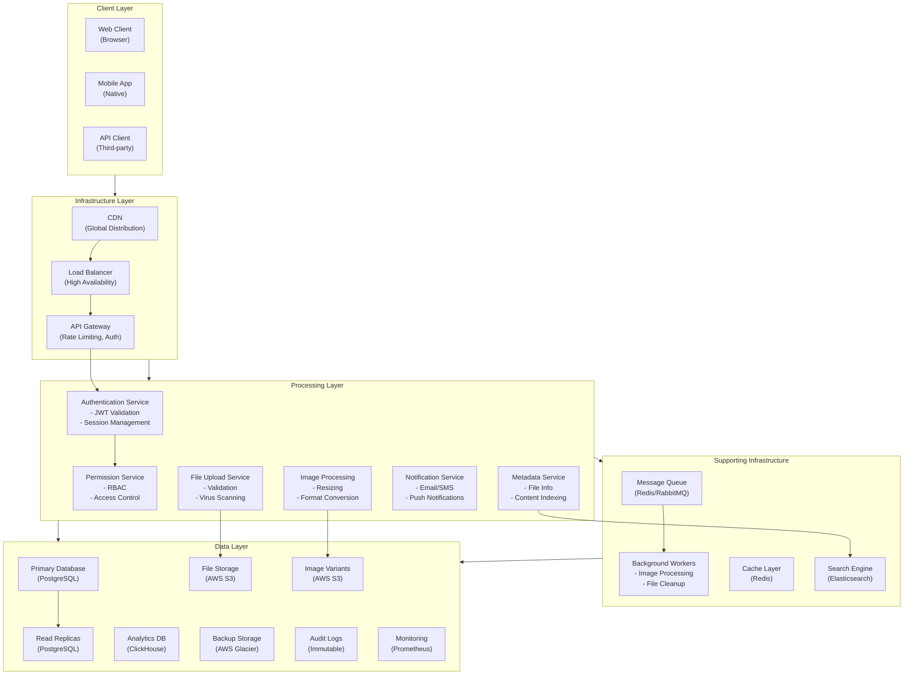
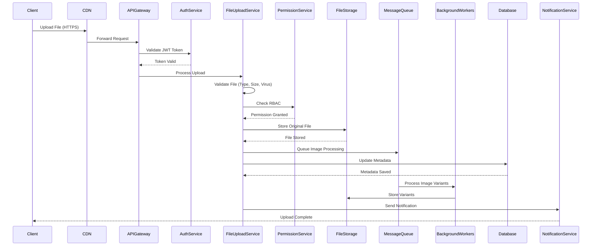
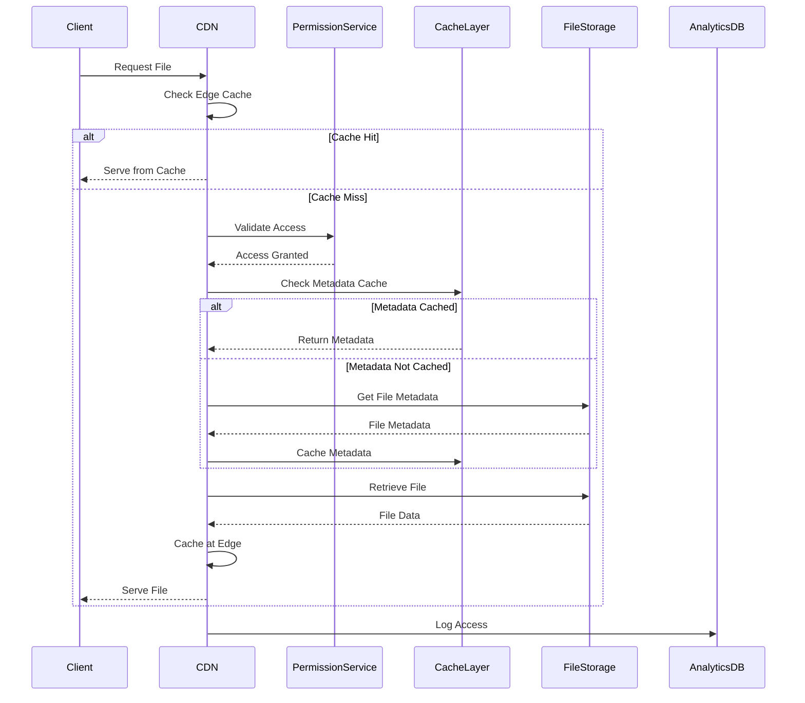
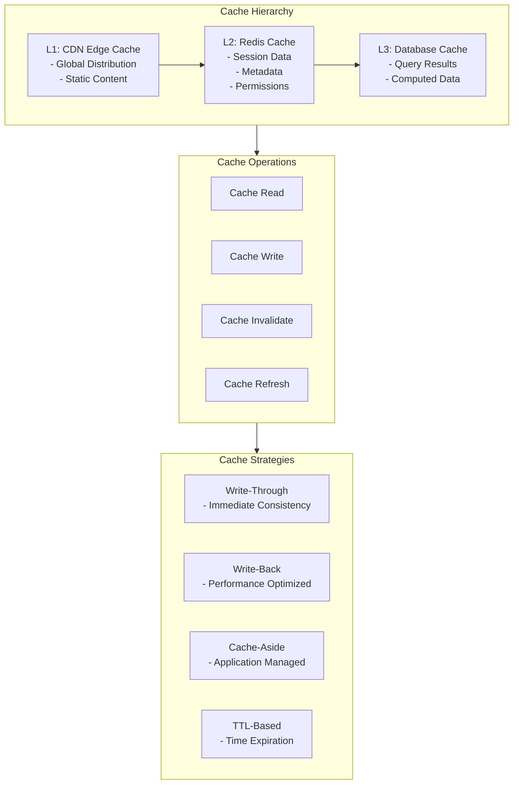
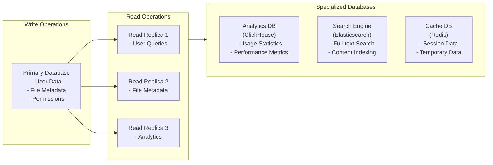
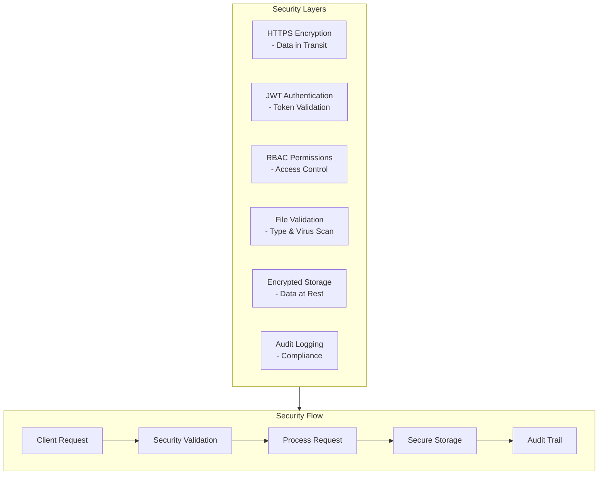

# Data Flow Diagram - Mermaid Diagrams

## System Architecture Overview

## File Upload Flow

## File Download Flow

## Data Processing Pipeline

```mermaid
flowchart LR
    subgraph SynchronousFlow ["Synchronous Processing"]
        UserAuth["User Authentication"]
        PermissionValidation["Permission Validation"]
        FileUpload["Immediate File Upload"]
        RealTimeDownload["Real-time Download"]
    end

    subgraph AsynchronousFlow ["Asynchronous Processing"]
        ImageProcessing["Image Processing"]
        SearchIndexing["Search Indexing"]
        NotificationDelivery["Notification Delivery"]
        AnalyticsProcessing["Analytics Processing"]
    end

    subgraph CachingStrategy ["Caching Strategy"]
        CDNEdgeCache["CDN Edge Caching"]
        RedisCache["Redis Data Caching"]
        QueryResultCache["DB Query Caching"]
    end

    subgraph DataReplication ["Data Replication"]
        DBReadReplicas["Database Read Replicas"]
        MultiRegionStorage["Multi-region Storage"]
        CrossAZRedundancy["Cross-AZ Redundancy"]
    end

    SynchronousFlow --> AsynchronousFlow
    AsynchronousFlow --> CachingStrategy
    CachingStrategy --> DataReplication
```

## Cache Operations

## Database Operations

## Performance Metrics

```mermaid
graph LR
    subgraph SpeedMetrics ["Speed & Throughput"]
        UploadSpeed["Upload Speed\n100MB/s average"]
        DownloadSpeed["Download Speed\n1GB/s via CDN"]
        APIThroughput["API Throughput\n10,000 req/sec"]
        DBResponseTime["DB Response\n<10ms"]
    end

    subgraph CacheMetrics ["Caching & Efficiency"]
        CacheHitRatio["Cache Hit Ratio\n>95%"]
        ImageProcessTime["Image Processing\n<30 seconds"]
        APILatency["API Latency\n<100ms (95th)"]
    end

    subgraph ReliabilityMetrics ["Reliability"]
        SystemAvailability["Availability\n99.99%"]
        StorageDurability["Storage Durability\n99.999999999%"]
        AutoFailover["Auto Failover\nEnabled"]
    end

    SpeedMetrics --> CacheMetrics
    CacheMetrics --> ReliabilityMetrics
```

## Security Data Flow

## Monitoring and Observability

```mermaid
flowchart LR
    subgraph MetricsCollection ["Metrics Collection"]
        ApplicationMetrics["Application Metrics\n- Response Times\n- Error Rates"]
        InfrastructureMetrics["Infrastructure Metrics\n- CPU, Memory\n- Network I/O"]
        BusinessMetrics["Business Metrics\n- Upload Volume\n- User Activity"]
    end

    subgraph Observability ["Observability"]
        DistributedTracing["Distributed Tracing\n- Request Flow"]
        CentralizedLogging["Centralized Logging\n- Log Analysis"]
        AlertingSystem["Alerting System\n- Incident Response"]
    end

    subgraph Dashboards ["Dashboards"]
        PerformanceDashboard["Performance Dashboard"]
        CapacityPlanning["Capacity Planning"]
        OptimizationInsights["Optimization Insights"]
    end

    MetricsCollection --> Observability
    Observability --> Dashboards
```

