# Database Schema - File Upload System (Mermaid)

## Entity Relationship Diagram

## Database Architecture Overview

```mermaid
flowchart TD
    subgraph Core["🏗️ Core Tables"]
        Users["👤 users<br/>User Management"]
        Files["📁 files<br/>File Metadata"]
        Groups["👥 user_groups<br/>Group Management"]
        Members["🔗 group_members<br/>Group Membership"]
    end

    subgraph Permissions["🔐 Permission System"]
        FilePerm["🔑 file_permissions<br/>Individual Access"]
        GroupPerm["🔑 group_file_permissions<br/>Group Access"]
    end

    subgraph Support["🛠️ Supporting Tables"]
        Variants["🖼️ image_variants<br/>Image Processing"]
        Logs["📊 activity_logs<br/>Audit Trail"]
        Tokens["🚫 revoked_tokens<br/>Security"]
    end

    subgraph Performance["⚡ Performance Layer"]
        Indexes["📇 Composite Indexes<br/>Query Optimization"]
        Partitions["📂 Table Partitioning<br/>Data Management"]
        Pool["🏊 Connection Pooling<br/>PgBouncer"]
        Cache["🚀 Redis Cache<br/>Query Caching"]
    end

    subgraph Security["🛡️ Security Features"]
        Encryption["🔒 Password Hashing<br/>bcrypt + salt"]
        JWT["🎫 JWT Management<br/>Token Blacklist"]
        Audit["📝 Complete Audit<br/>Activity Tracking"]
        RBAC["👮 Role-Based Access<br/>Granular Permissions"]
    end

    subgraph Scaling["📈 Scalability"]
        Sharding["🔀 Database Sharding<br/>Horizontal Scaling"]
        Replicas["📚 Read Replicas<br/>Load Distribution"]
        Archive["📦 Data Archival<br/>Cold Storage"]
        Backup["💾 Backup Strategy<br/>Cross-Region"]
    end

    %% Connections
    Core --> Permissions
    Core --> Support
    Permissions --> Performance
    Support --> Performance
    Performance --> Security
    Security --> Scaling
```

## Permission Flow Diagram

```mermaid
flowchart LR
    subgraph User["👤 User Access"]
        U1["User Request"]
        U2["Check Permissions"]
        U3["Grant/Deny Access"]
    end

    subgraph Individual["🔑 Individual Permissions"]
        I1["file_permissions"]
        I2["Direct User Access"]
    end

    subgraph Group["👥 Group Permissions"]
        G1["group_members"]
        G2["group_file_permissions"]
        G3["Inherited Access"]
    end

    subgraph Actions["⚡ Permission Types"]
        A1["📖 can_read"]
        A2["⬇️ can_download"]
        A3["✏️ can_write"]
        A4["🔗 can_share"]
    end

    U1 --> U2
    U2 --> Individual
    U2 --> Group
    Individual --> I1 --> I2
    Group --> G1 --> G2 --> G3
    I2 --> Actions
    G3 --> Actions
    Actions --> U3
```

## Data Flow & Operations

## Index Strategy

## Monitoring & Maintenance

```mermaid
graph LR
    subgraph Monitor["📊 Monitoring"]
        M1["🐌 Slow Query Log"]
        M2["📈 Index Usage"]
        M3["🔗 Connection Metrics"]
        M4["💾 Storage Usage"]
    end

    subgraph Maintain["🔧 Maintenance"]
        MT1["🧹 VACUUM"]
        MT2["🔄 REINDEX"]
        MT3["📊 ANALYZE"]
        MT4["✂️ Partition Pruning"]
    end

    Monitor --> Maintain
```

