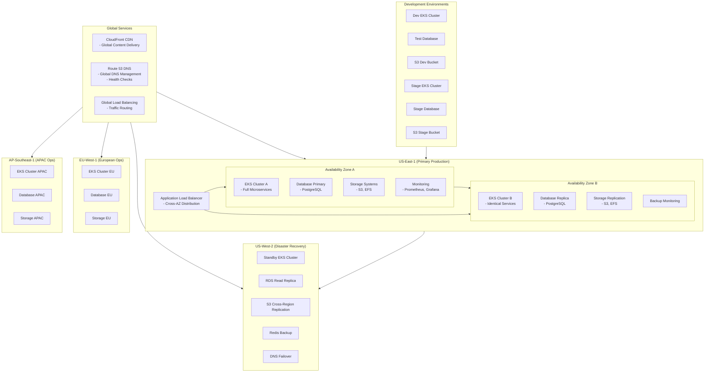
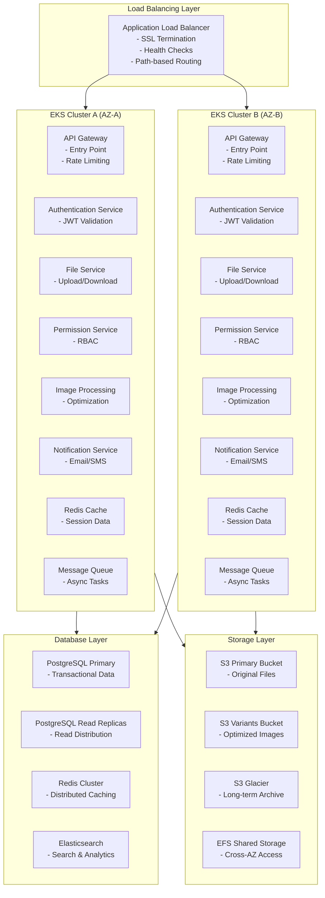
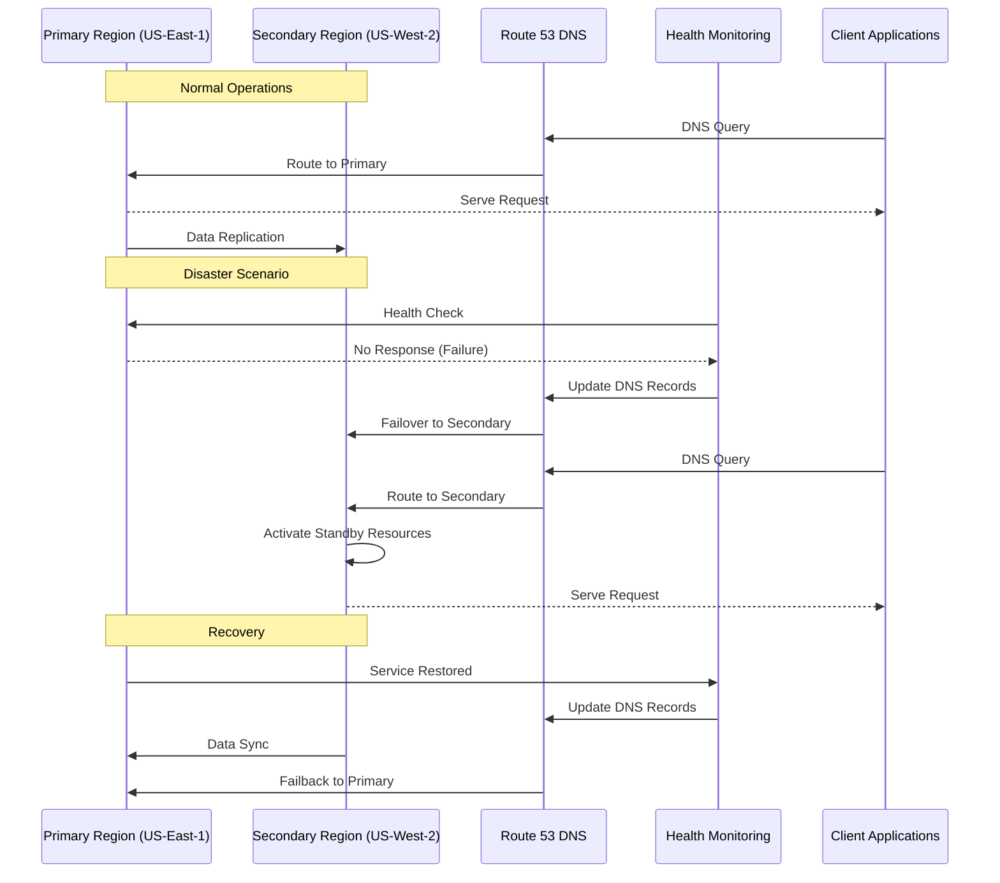
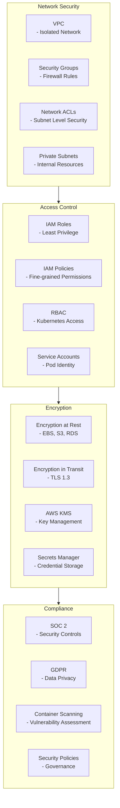

# Deployment Architecture - Mermaid Diagrams

## Global Infrastructure Overview

## Kubernetes Deployment Architecture

## CI/CD Pipeline

```mermaid
flowchart LR
    %% Source Control
    subgraph SourceControl ["Source Control"]
        GitHub["GitHub\n- Version Control\n- Branch Protection\n- PR Workflows"]
    end

    %% Build & Test
    subgraph BuildTest ["Build & Test"]
        GitHubActions["GitHub Actions\n- Automated Testing\n- Code Quality\n- Unit Tests"]
    end

    %% Security Scan
    subgraph SecurityScan ["Security Scan"]
        Snyk["Snyk\n- Vulnerability Scan"]
        SonarQube["SonarQube\n- Code Quality"]
        DepCheck["Dependency Check\n- Security Analysis"]
    end

    %% Container Build
    subgraph ContainerBuild ["Container Build"]
        Docker["Docker\n- Image Creation"]
        ECR["ECR\n- Container Registry"]
        ImageScan["Image Vulnerability\nScanning"]
    end

    %% Deploy Staging
    subgraph DeployStaging ["Deploy Staging"]
        ArgoCD["ArgoCD\n- GitOps Deployment"]
        StagingEnv["Staging Environment\n- Pre-production"]
    end

    %% Testing
    subgraph Testing ["Integration Testing"]
        E2ETest["End-to-End Testing"]
        APITest["API Testing"]
        LoadTest["Performance Testing"]
    end

    %% Approval
    subgraph Approval ["Manual Approval"]
        ChangeReview["Change Review\n- Risk Assessment"]
        ProductionGate["Production Gate"]
    end

    %% Deploy Production
    subgraph DeployProd ["Deploy Production"]
        BlueGreen["Blue/Green\nDeployment"]
        CanaryDeploy["Canary\nDeployment"]
        RollingUpdate["Rolling\nUpdate"]
    end

    %% Post-Deploy
    subgraph PostDeploy ["Post-Deploy Monitoring"]
        HealthCheck["Health Checks"]
        PerfMonitor["Performance\nMonitoring"]
        Validation["Deployment\nValidation"]
    end

    %% Flow
    SourceControl --> BuildTest
    BuildTest --> SecurityScan
    SecurityScan --> ContainerBuild
    ContainerBuild --> DeployStaging
    DeployStaging --> Testing
    Testing --> Approval
    Approval --> DeployProd
    DeployProd --> PostDeploy
```

## Monitoring & Observability

```mermaid
flowchart TD
    %% Monitoring Tools
    subgraph MonitoringTools ["Monitoring Tools"]
        Prometheus["Prometheus\n- Metrics Collection\n- Alerting\n- Service Discovery"]
        Grafana["Grafana\n- Visualization\n- Dashboards\n- Alert Integration"]
        Jaeger["Jaeger\n- Distributed Tracing\n- Request Flow\n- Performance Analysis"]
        ELKStack["ELK Stack\n- Log Aggregation\n- Search & Analysis\n- Real-time Streaming"]
        CloudWatch["CloudWatch\n- AWS Native Monitoring\n- Infrastructure Metrics"]
        PagerDuty["PagerDuty\n- Incident Management\n- On-call Rotation"]
        Datadog["Datadog\n- APM\n- RUM\n- Infrastructure"]
    end

    %% SLI/SLO Metrics
    subgraph SLIMetrics ["SLI/SLO Metrics"]
        Availability["Availability\n99.99% (SLO: 99.9%)"]
        Latency["Latency P95\n<100ms (SLO: <200ms)"]
        ErrorRate["Error Rate\n<0.1% (SLO: <1%)"]
        Throughput["Throughput\n10,000 req/sec"]
        MTTR["MTTR\n<15 minutes"]
        MTBF["MTBF\n>720 hours"]
    end

    %% Alert Channels
    subgraph AlertChannels ["Alert Channels"]
        SlackIntegration["Slack Integration\n- Team Notifications"]
        EmailNotifications["Email Notifications\n- Detailed Alerts"]
        SMSCritical["SMS Critical\n- Immediate Notification"]
        WebhookIntegration["Webhook Integration\n- Custom Integrations"]
        AutoScaling["Auto-scaling Triggers\n- Automated Response"]
        RunbookAutomation["Runbook Automation\n- Automated Remediation"]
    end

    MonitoringTools --> SLIMetrics
    SLIMetrics --> AlertChannels
```

## Disaster Recovery Architecture

## Scaling Mechanisms

```mermaid
flowchart LR
    %% Auto Scaling
    subgraph AutoScaling ["Auto Scaling"]
        HPA["Horizontal Pod Autoscaler\n- CPU/Memory Based"]
        VPA["Vertical Pod Autoscaler\n- Resource Optimization"]
        ClusterAutoscaler["Cluster Autoscaler\n- Node Scaling"]
        CustomMetrics["Custom Metrics Scaling\n- Business Logic"]
    end

    %% Deployment Strategies
    subgraph DeploymentStrategies ["Deployment Strategies"]
        BlueGreenDeploy["Blue/Green\n- Zero Downtime\n- Instant Rollback"]
        CanaryDeploy["Canary\n- Gradual Rollout\n- Risk Mitigation"]
        RollingUpdates["Rolling Updates\n- Continuous Availability"]
    end

    %% Fault Tolerance
    subgraph FaultTolerance ["Fault Tolerance"]
        CircuitBreaker["Circuit Breaker\n- Hystrix Pattern\n- Graceful Degradation"]
        FeatureFlags["Feature Flags\n- LaunchDarkly\n- A/B Testing"]
        GitOps["GitOps (ArgoCD)\n- Declarative Config\n- Git-based Workflows"]
    end

    AutoScaling --> DeploymentStrategies
    DeploymentStrategies --> FaultTolerance
```

## Security & Compliance

## Cost Optimization

```mermaid
flowchart LR
    %% Compute Optimization
    subgraph ComputeOptimization ["Compute Optimization"]
        ReservedInstances["Reserved Instances\n- Predictable Workloads"]
        SpotInstances["Spot Instances\n- Non-critical Workloads"]
        RightSizing["Right Sizing\n- Resource Optimization"]
        AutoScaling["Auto Scaling\n- Demand Matching"]
    end

    %% Storage Optimization
    subgraph StorageOptimization ["Storage Optimization"]
        S3IntelligentTiering["S3 Intelligent Tiering\n- Automatic Optimization"]
        LifecyclePolicies["Lifecycle Policies\n- Automated Transitions"]
        DataCompression["Data Compression\n- Storage Efficiency"]
        UnusedResourceCleanup["Unused Resource Cleanup\n- Cost Reduction"]
    end

    %% Cost Management
    subgraph CostManagement ["Cost Management"]
        ResourceTagging["Resource Tagging\n- Cost Allocation"]
        CostAnalysis["Cost Analysis\n- Regular Reviews"]
        BudgetAlerts["Budget Alerts\n- Spending Control"]
        CostOptimizationRecommendations["Optimization Recommendations\n- AWS Trusted Advisor"]
    end

    ComputeOptimization --> StorageOptimization
    StorageOptimization --> CostManagement
```

