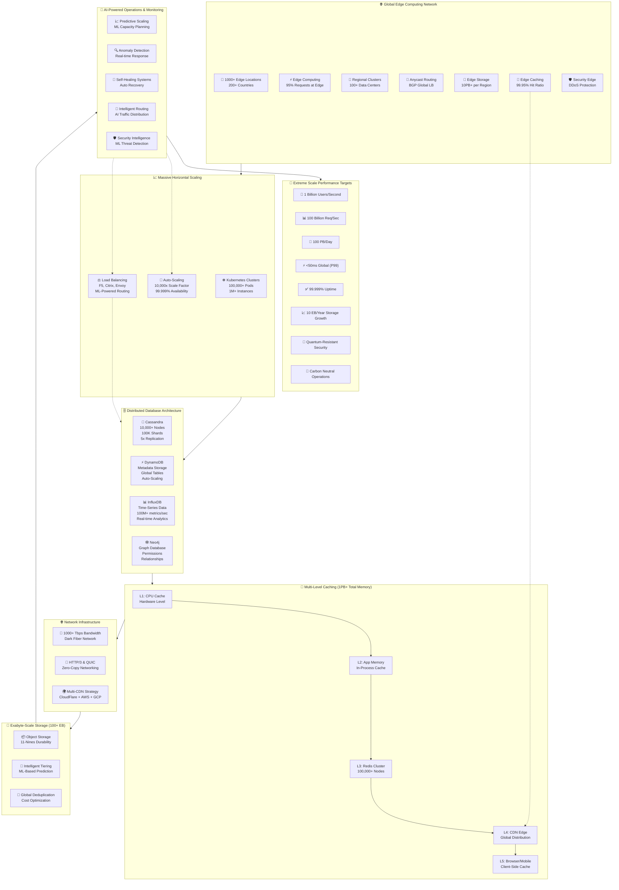
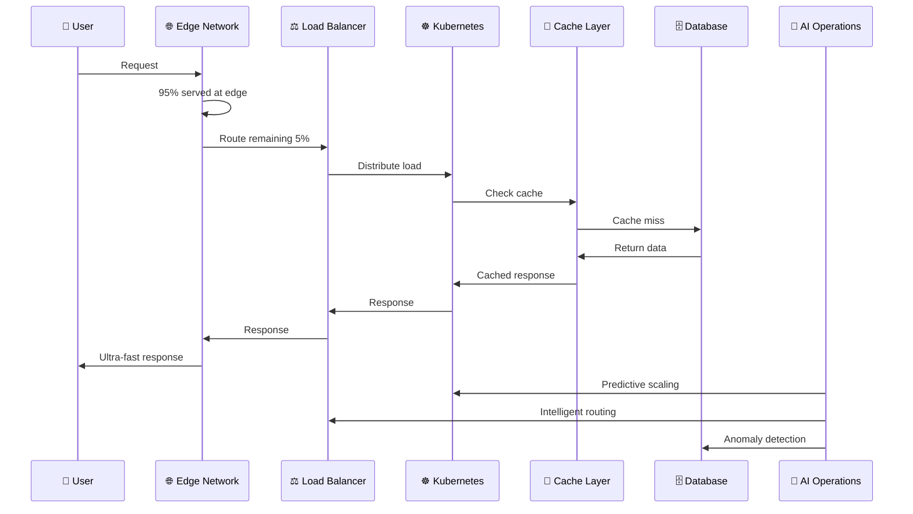
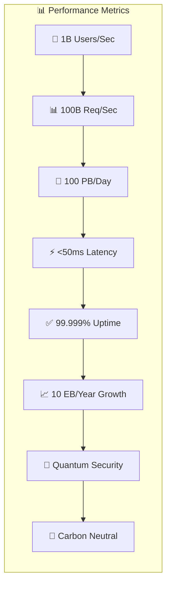

# Hyperscale Architecture - 1 Billion Users/Second (Mermaid)

```mermaid
flowchart TD
    %% Global Edge Computing Network
    subgraph Edge["🌐 Global Edge Computing Network"]
        EdgeLoc["📍 1000+ Edge Locations<br/>200+ Countries"]
        EdgeComp["⚡ Edge Computing<br/>95% Requests at Edge"]
        RegCluster["🏢 Regional Clusters<br/>100+ Data Centers"]
        Anycast["🔀 Anycast Routing<br/>BGP Global LB"]
        EdgeStore["💾 Edge Storage<br/>10PB+ per Region"]
        EdgeCache["🚀 Edge Caching<br/>99.95% Hit Ratio"]
        SecEdge["🛡️ Security Edge<br/>DDoS Protection"]
    end

    %% Massive Horizontal Scaling
    subgraph Scaling["📈 Massive Horizontal Scaling"]
        K8s["☸️ Kubernetes Clusters<br/>100,000+ Pods<br/>1M+ Instances"]
        AutoScale["🔄 Auto-Scaling<br/>10,000x Scale Factor<br/>99.999% Availability"]
        LoadBal["⚖️ Load Balancing<br/>F5, Citrix, Envoy<br/>ML-Powered Routing"]
    end

    %% Distributed Database Architecture
    subgraph Database["🗄️ Distributed Database Architecture"]
        Cassandra["🔗 Cassandra<br/>10,000+ Nodes<br/>100K Shards<br/>5x Replication"]
        DynamoDB["⚡ DynamoDB<br/>Metadata Storage<br/>Global Tables<br/>Auto-Scaling"]
        InfluxDB["📊 InfluxDB<br/>Time-Series Data<br/>100M+ metrics/sec<br/>Real-time Analytics"]
        Neo4j["🕸️ Neo4j<br/>Graph Database<br/>Permissions<br/>Relationships"]
    end

    %% Multi-Level Caching Strategy
    subgraph Cache["🚀 Multi-Level Caching (1PB+ Total Memory)"]
        L1["L1: CPU Cache<br/>Hardware Level"]
        L2["L2: App Memory<br/>In-Process Cache"]
        L3["L3: Redis Cluster<br/>100,000+ Nodes"]
        L4["L4: CDN Edge<br/>Global Distribution"]
        L5["L5: Browser/Mobile<br/>Client-Side Cache"]
        
        L1 --> L2 --> L3 --> L4 --> L5
    end

    %% Network Infrastructure
    subgraph Network["🌐 Network Infrastructure"]
        Bandwidth["🚄 1000+ Tbps Bandwidth<br/>Dark Fiber Network"]
        HTTP3["🔄 HTTP/3 & QUIC<br/>Zero-Copy Networking"]
        MultiCDN["🌍 Multi-CDN Strategy<br/>CloudFlare + AWS + GCP"]
    end

    %% Exabyte-Scale Storage
    subgraph Storage["💾 Exabyte-Scale Storage (100+ EB)"]
        ObjectStore["📦 Object Storage<br/>11-Nines Durability"]
        IntelTier["🧠 Intelligent Tiering<br/>ML-Based Prediction"]
        GlobalDedup["🔄 Global Deduplication<br/>Cost Optimization"]
    end

    %% AI-Powered Operations
    subgraph AI["🤖 AI-Powered Operations & Monitoring"]
        PredScale["📈 Predictive Scaling<br/>ML Capacity Planning"]
        AnomalyDet["🔍 Anomaly Detection<br/>Real-time Response"]
        SelfHeal["🔧 Self-Healing Systems<br/>Auto Recovery"]
        IntelRoute["🧭 Intelligent Routing<br/>AI Traffic Distribution"]
        SecIntel["🛡️ Security Intelligence<br/>ML Threat Detection"]
    end

    %% Performance Targets
    subgraph Targets["🎯 Extreme Scale Performance Targets"]
        Users["👥 1 Billion Users/Second"]
        Requests["📊 100 Billion Req/Sec"]
        DataThroughput["💾 100 PB/Day"]
        Latency["⚡ <50ms Global (P99)"]
        Uptime["✅ 99.999% Uptime"]
        Growth["📈 10 EB/Year Storage Growth"]
        Quantum["🔐 Quantum-Resistant Security"]
        Carbon["🌱 Carbon Neutral Operations"]
    end

    %% Connections
    Edge --> Scaling
    Scaling --> Database
    Database --> Cache
    Cache --> Network
    Network --> Storage
    Storage --> AI
    AI --> Targets

    %% Cross-connections for data flow
    EdgeCache -.-> L4
    LoadBal -.-> Database
    AI -.-> AutoScale
    AI -.-> LoadBal
```

## Architecture Flow

```mermaid
sequenceDiagram
    participant User as 👤 User
    participant Edge as 🌐 Edge Network
    participant LB as ⚖️ Load Balancer
    participant K8s as ☸️ Kubernetes
    participant Cache as 🚀 Cache Layer
    participant DB as 🗄️ Database
    participant AI as 🤖 AI Operations

    User->>Edge: Request
    Edge->>Edge: 95% served at edge
    Edge->>LB: Route remaining 5%
    LB->>K8s: Distribute load
    K8s->>Cache: Check cache
    Cache->>DB: Cache miss
    DB->>Cache: Return data
    Cache->>K8s: Cached response
    K8s->>LB: Response
    LB->>Edge: Response
    Edge->>User: Ultra-fast response
    
    AI->>K8s: Predictive scaling
    AI->>LB: Intelligent routing
    AI->>DB: Anomaly detection
```

## Key Performance Metrics

```mermaid
graph LR
    subgraph Metrics["📊 Performance Metrics"]
        A["👥 1B Users/Sec"] --> B["📊 100B Req/Sec"]
        B --> C["💾 100 PB/Day"]
        C --> D["⚡ <50ms Latency"]
        D --> E["✅ 99.999% Uptime"]
        E --> F["📈 10 EB/Year Growth"]
        F --> G["🔐 Quantum Security"]
        G --> H["🌱 Carbon Neutral"]
    end
```