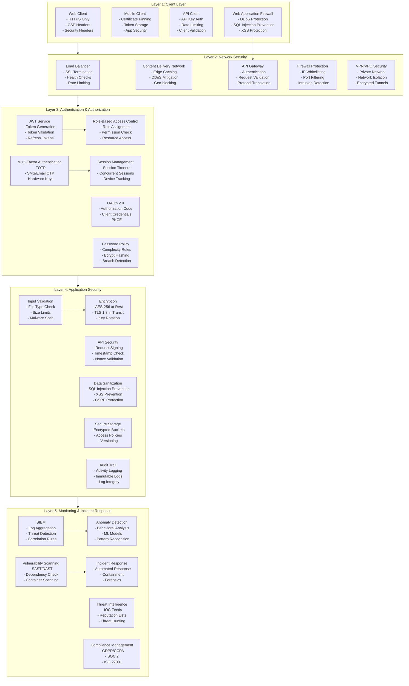
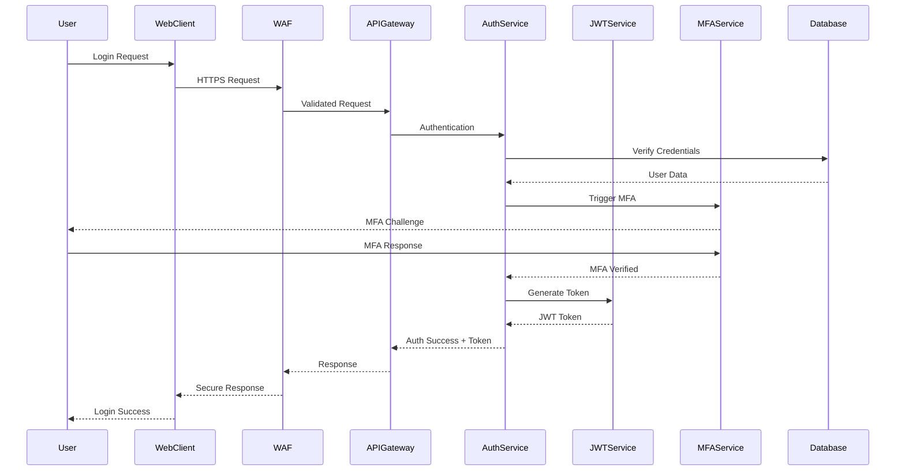
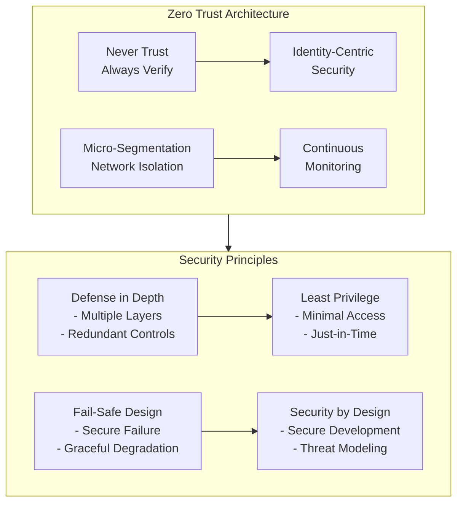
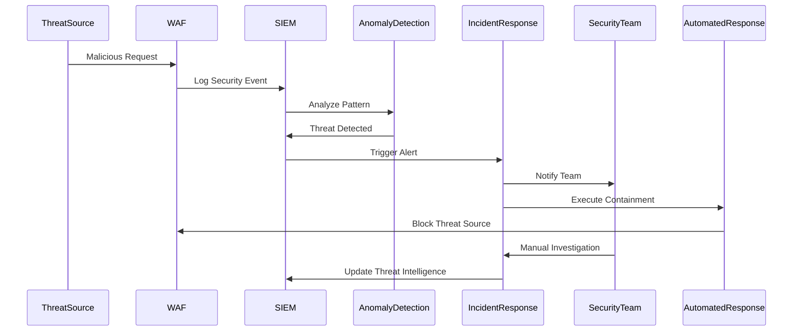

# Security Architecture - Mermaid Diagrams

## Multi-Layered Security Architecture

## Security Controls Framework

```mermaid
flowchart LR
    subgraph PreventiveControls ["Preventive Controls"]
        AccessControl["Access Control\n- RBAC\n- MFA"]
        EncryptionControl["Encryption\n- End-to-end\n- Data Protection"]
        InputValidationControl["Input Validation\n- Malicious Input\n- Prevention"]
        NetworkSecurityControl["Network Security\n- Firewall\n- VPN Protection"]
    end

    subgraph DetectiveControls ["Detective Controls"]
        SIEMControl["SIEM\n- Real-time Monitoring\n- Alerting"]
        AnomalyControl["Anomaly Detection\n- Behavioral Analysis"]
        VulnScanControl["Vulnerability Scanning\n- Security Assessments"]
        AuditControl["Audit Logging\n- Activity Tracking"]
    end

    subgraph CorrectiveControls ["Corrective Controls"]
        IncidentControl["Incident Response\n- Automated Response"]
        PatchControl["Patch Management\n- Vulnerability Remediation"]
        BackupControl["Backup & Recovery\n- Data Restoration"]
        UpdateControl["Security Updates\n- Regular Improvements"]
    end

    PreventiveControls --> DetectiveControls
    DetectiveControls --> CorrectiveControls
    CorrectiveControls --> PreventiveControls
```

## Authentication Flow Sequence

## Zero Trust Architecture

## Risk Management Framework

```mermaid
flowchart LR
    subgraph RiskAssessment ["Risk Assessment"]
        ThreatModeling["Threat Modeling\n- Systematic Identification"]
        RiskScoring["Risk Scoring\n- Quantitative Evaluation"]
        ImpactAnalysis["Impact Analysis\n- Business Assessment"]
        MitigationPlanning["Mitigation Planning\n- Risk Reduction"]
    end

    subgraph SecurityGovernance ["Security Governance"]
        SecurityPolicies["Security Policies\n- Comprehensive Guidelines"]
        SecurityTraining["Security Training\n- Staff Education"]
        SecurityReviews["Security Reviews\n- Periodic Assessments"]
        ComplianceMonitoring["Compliance Monitoring\n- Regulatory Adherence"]
    end

    subgraph BusinessContinuity ["Business Continuity"]
        DisasterRecovery["Disaster Recovery\n- System Recovery"]
        BCPlanning["BC Planning\n- Operational Continuity"]
        DataBackup["Data Backup\n- Regular Protection"]
        ServiceAvailability["Service Availability\n- High Availability"]
    end

    RiskAssessment --> SecurityGovernance
    SecurityGovernance --> BusinessContinuity
    BusinessContinuity --> RiskAssessment
```

## Security Metrics Dashboard

```mermaid
graph LR
    subgraph AuthMetrics ["Authentication Metrics"]
        AuthSuccess["Auth Success Rate: >99.9%"]
        FailedLogins["Failed Logins: <0.1%"]
        MFAAdoption["MFA Adoption: >95%"]
        PasswordCompliance["Password Compliance: >98%"]
    end

    subgraph IncidentMetrics ["Incident Response Metrics"]
        ResponseTime["Response Time: <15 min"]
        VulnRemediation["Vuln Remediation: <24h"]
        MTTD["MTTD: <5 min"]
        MTTR["MTTR: <30 min"]
    end

    subgraph ProtectionMetrics ["Protection Metrics"]
        MalwareDetection["Malware Detection: >99.99%"]
        DataBreach["Data Breach: 0%"]
        DDoSMitigation["DDoS Mitigation: >99.9%"]
        FalsePositive["False Positive: <1%"]
    end

    subgraph ComplianceMetrics ["Compliance Metrics"]
        EncryptionCoverage["Encryption: 100%"]
        ComplianceScore["Compliance: >95%"]
        TrainingCompletion["Training: >98%"]
        AuditFindings["Audit Findings: <5/quarter"]
    end

    AuthMetrics --> IncidentMetrics
    IncidentMetrics --> ProtectionMetrics
    ProtectionMetrics --> ComplianceMetrics
```

## Threat Detection and Response

